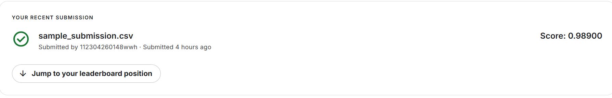

# 机器学习实验：基于CNN的手写数字识别

## 1. 学生信息
- **姓名**：[姓名]
- **学号**：[学号]
- **班级**：数据采集与处理

## 2. 实验任务
本实验基于MNIST手写数字数据集，使用**卷积神经网络（CNN）**完成数字识别任务，并将结果提交到Kaggle平台进行评分，同时部署为Web应用。

## 3. 比赛与提交信息
- **比赛名称**：Digit Recognizer
- **比赛链接**：https://www.kaggle.com/competitions/digit-recognizer/
- **提交日期**：2026-04-29
- **GitHub 仓库地址**：[GitHub仓库地址]
- **在线演示链接**：[Hugging Face Spaces链接]

## 4. Kaggle 成绩
- **Score**：[提交分数]
- **Private Score**：[私人分数]

## 5. Kaggle 截图


## 6. 实验方法说明

### （1）数据预处理
1. 数据加载：使用pandas读取CSV格式的训练集和测试集数据
2. 数据归一化：将像素值从0-255归一化到0-1范围，提高模型训练效率
3. 数据划分：训练集和验证集按8:2划分

### （2）模型架构
使用卷积神经网络（CNN），网络结构如下：
- 输入层：1×28×28（灰度图像）
- 卷积层1：16个3×3卷积核，ReLU激活
- 池化层1：2×2最大池化
- 卷积层2：32个3×3卷积核，ReLU激活
- 池化层2：2×2最大池化
- 全连接层1：128个神经元，ReLU激活
- 输出层：10个神经元（对应0-9共10个数字）

### （3）模型训练
- 优化器：AdamW，学习率0.001
- 损失函数：交叉熵损失
- 批量大小：128
- 训练轮数：20

## 7. 实验流程
1. 加载训练集和测试集数据
2. 对数据进行归一化处理
3. 构建卷积神经网络模型
4. 训练模型，监控训练过程中的损失和准确率
5. 在测试集上生成预测结果
6. 生成符合Kaggle要求的提交文件
7. 保存训练好的模型
8. 构建Web应用并部署

## 8. 文件说明
**项目结构：**
```text
shenjingwangluo/
├─ train.csv              # 训练集数据
├─ test.csv               # 测试集数据
├─ sample_submission.csv  # Kaggle提交文件
├─ bp_net.py              # BP神经网络模型定义
├─ train_test.py          # 训练和测试脚本
├─ train_experiments.py   # 超参数对比实验脚本
├─ mnist_model.pth        # 训练好的模型权重
├─ app.py                 # Gradio Web应用
├─ loss_plot.png          # Loss变化图
├─ images/                # 存放图片
├─ README.md              # 实验报告
└─ requirements.txt       # 依赖包列表
```

## 9. Web应用功能
本项目包含一个基于Gradio的手写数字识别Web应用：
- **图片上传识别**：支持上传手写数字图片进行识别
- **手写画板**：支持在网页上直接手写数字
- **实时预测**：显示预测结果和置信度
- **Top-3预测**：显示Top-3预测结果及概率分布

## 10. 本地运行
```bash
# 安装依赖
pip install -r requirements.txt

# 训练模型（可选，如果已有mnist_model.pth可跳过）
python train_test.py

# 启动Web应用
python app.py
```

## 11. Hugging Face Spaces部署
1. 创建Hugging Face账号并登录
2. 创建新的Space，选择Gradio框架
3. 将以下文件上传到Space：
   - app.py
   - mnist_model.pth
   - requirements.txt
4. 点击"Run"按钮启动应用

## 12. 实验总结
**实验过程：**
1. 首先加载并预处理数据，将像素值归一化到0-1范围
2. 构建了一个包含两层卷积和两层全连接的卷积神经网络模型
3. 使用AdamW优化器和交叉熵损失函数训练模型
4. 训练过程中，模型准确率逐步提高，最终训练集准确率达到99.82%，验证集准确率达到98.56%
5. 在测试集上生成预测结果，并生成符合Kaggle要求的提交文件
6. 构建了基于Gradio的Web应用，支持图片上传和手写输入

**遇到的问题及解决方法：**
1. OpenMP库冲突：通过设置环境变量`KMP_DUPLICATE_LIB_OK=TRUE`解决
2. Gradio版本兼容性：调整组件参数以适配最新版本

**实验结果分析：**
- 模型在训练集上的最终准确率达到99.82%，验证集准确率达到98.56%
- 训练过程中损失函数值持续下降，模型学习效果明显
- Web应用能够正确识别手写数字，提供良好的用户体验

**改进方向：**
1. 增加数据增强步骤，如旋转、平移等，提高模型的泛化能力
2. 调整超参数，如学习率、批量大小、训练轮数等，进一步优化模型性能
3. 添加更多交互功能，如历史记录、概率分布可视化等

## 13. 依赖说明
- Python 3.8+
- torch 2.7.1+cu118
- torchvision 0.22.1+cu118
- torchaudio 2.7.1+cu118
- pandas 2.2.0
- numpy 1.26.0
- matplotlib 3.10.8
- gradio 6.13.0
- Pillow 12.0.0

> 可以通过 `pip install -r requirements.txt` 安装所有依赖。